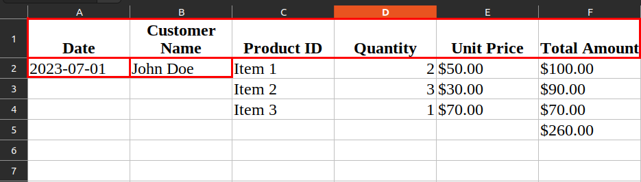

# Invoice to PDF Converter

The Invoice to PDF Converter is a web application that allows you to convert XLSX invoice files into PDF format. With this app, you can easily upload your invoice files, convert them to PDF, and download the generated PDF files.

## How to Use the App

1. Visit provided URL: https://invoice2pdf.streamlit.app/ or run the app locally.
   -  If running the app locally, make sure you have the required packages installed. You can install them by running the following command in the terminal:
        ```bash
        pip install -r requirements.txt
        ```
   -  To run the app locally, run the following command in the terminal:
        ```bash
        streamlit run app.py
        ```
   - After that you can visit the app at adress provided in the termianal (should be http://localhost:8501/).
2. Name invoice files so that the invoice number is prefaced with '-' (e.g., 'Invoice-<invoice number>.xlsx').
3. Prepare your invoice files in XLSX format, according to the template provided.
   
   - The first row of the XLSX file should contain the exact column titles.
   - Date and customer name should be entered as shown in red.
   - Total price needs to be calculated at the bottom.
4. Upload your invoice files using the file uploader (click 'Browse files' or use drag and drop).
5. Click the 'Convert to PDF' button to start the conversion process.
6. After the conversion process is complete, you can download the generated PDF files.
